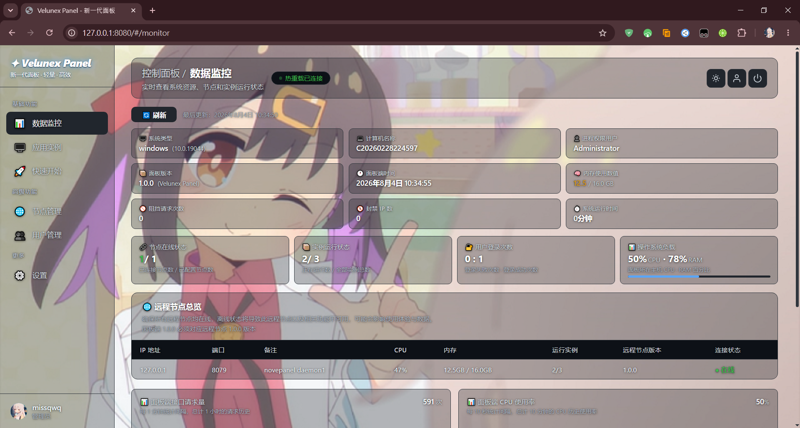

<h1 align="center">VelunexPanel</h1>

<p align="center">
<strong>Full Go Stack · Zero-Dependency Deployment · Built for Minecraft and Console Applications</strong>
</p>

> Lightweight · Efficient · Ready-to-use server management panel (Early Development Build)
<div align="center">

[]()
[](https://golang.org/)
[](https://nodejs.org/)

</div>

<p align="center">

</p>

---

<div align="center">

[English](README.md) - [简体中文](README_ZH.md) - [繁體中文](README_TW.md)

</div>

---

<table>
<tr>
<td align="center" style="background-color: #ffebee; color: #48c628; padding: 12px; border-radius: 6px;">
<strong>🕰️ Last Updated: August 4, 2026</strong>
</td>
</tr>
</table>


<table>
<tr>
<td align="center" style="background-color: #ffebee; color: #c62828; padding: 12px; border-radius: 6px;">
<strong>⚠️ Note: This project is currently in the early stages of development (alpha) and is under active development. Some features may be incomplete; feedback is welcome!</strong>
</td>
</tr>
</table> </strong>
</td>
</tr>
</table>

<table>
<tr>
<td align="center" style="background-color: #ffebee; color: #c6bb28; padding: 12px; border-radius: 6px;">
<strong>💡 Tip: 2FA currently supports manual entry only and does not support QR code scanning; we welcome contributions via pull requests to resolve this issue.</strong>
</td>
</tr>
</table>

---

## 📖 Introduction

This is **NovaPanel** (a lightweight panel based on **MCSManager**), created by **0721xun** (now known as **missqwq**). It is an out-of-the-box server management panel designed specifically for **Minecraft servers** and **all console-based applications**.

NovaPanel aims to deliver a **lightweight, efficient, and ready-to-use** management experience—no complex configuration required; simply download and start using it immediately. ---

## ✨ Features

- 🚀 **Lightweight & Efficient** - Built with Go; low resource footprint
- 📦 **Ready-to-Use** - Built-in Node.js runtime; no manual installation required
- 🔌 **Distributed Architecture** - Supports remote node management and horizontal scaling
- 🎮 **Minecraft Support** - Optimized specifically for Minecraft servers
- 🖥️ **Cross-Platform Support** - Supports Windows Server and Ubuntu Server (Linux)
- 📶 **Cross-Platform Remote Nodes** - Supports NovaPanel / MCSManager daemons
- 🔥 **Hot Reloading** - Auto-refresh on code changes for a smooth development experience
- 📊 **Real-time Monitoring** - System overview with real-time CPU, memory, and disk monitoring
- 🔐 **Secure Authentication** - Account/password login with 2FA and brute-force protection
- 🌏 **Language Support** - Supports Simplified Chinese, Traditional Chinese, and English (currently)

---

## 🛠️ Tech Stack

| Layer | Technology | Description |
|------|------|------|
| Frontend | Go | Modern management interface |
| Web Backend | Go | High-performance web service |
| Remote Node | Go | Distributed node management |
| File Management | Go | Real-time file management |
| API Service | Node.js + Express | Data interfaces |
| Communication Protocol | WebSocket | Real-time bidirectional communication |

---

## 📦 Quick Start

### Prerequisites

- Windows Server / Ubuntu Server (Linux)
- **Go required** (v1.21+ recommended): https://golang.google.cn/dl/
- **Node.js is built-in**; no extra installation needed

> ⚠️ Ensure Go is added to your system PATH after installation (check the "Add to PATH" option during setup)

### Download & Launch

```bash
# Clone the project (Fork this repository first)
git clone https://github.com/your-username/NovaPanel.git
cd NovaPanel

# Or simply click the link below to download
Click here to download → https://github.com/VelunexPanel/VelunexPanel/archive/refs/heads/main.zip

# For Windows: simply launch to use (Node.js is built-in)
run.bat

# For Linux: clone the project (please fork this repository first)
cd /opt
git clone https://github.com/your-username/NovaPanel.git

# Or simply click this link to download
Click here to download → https://github.com/VelunexPanel/VelunexPanel/archive/refs/heads/main.zip

# For Linux: simply launch to use (automatically installs and sets up startup on boot)
cd /opt/NovaPanel
run.sh